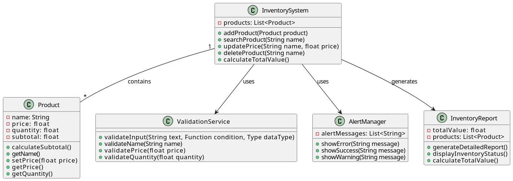

# 📊 Diagrama-UML

### 🎯 Diagrama

### 🎯 1. Propósito del Sistema
El sistema está diseñado para gestionar un inventario de productos, permitiendo agregar, buscar, actualizar y eliminar productos, además de calcular valores totales y generar reportes.

### 🔍 2. Explicación de las Clases

**1. 📦 Product (Producto)**
- **¿Qué es?** Es la clase que representa cada producto individual en el inventario
- **¿Qué contiene?**
    - 📝 Nombre del producto
    - 💰 Precio
    - 🔢 Cantidad
    - 💵 Subtotal

- **¿Por qué es necesaria?** 🤔 Porque necesitamos almacenar la información básica de cada producto

**2. 🏭 InventorySystem (Sistema de Inventario)**
- **¿Qué es?** Es la clase principal que controla todo el sistema
- **¿Qué hace?**
    - ➕ Agrega productos
    - 🔎 Busca productos
    - 🔄 Actualiza precios
    - ❌ Elimina productos
    - 🧮 Calcula valores totales

- **¿Por qué es necesaria?** 🎮 Porque necesitamos un controlador central que maneje todas las operaciones

**3. ✅ ValidationService (Servicio de Validación)**
- **¿Qué es?** Es la clase que verifica que los datos ingresados sean correctos
- **¿Qué valida?**
    - 📝 Nombres de productos
    - 💰 Precios
    - 🔢 Cantidades

- **¿Por qué es necesaria?** ⚖️ Para asegurar que todos los datos ingresados sean válidos

**4. ⚡ AlertManager (Gestor de Alertas)**
- **¿Qué es?** Es la clase que maneja los mensajes para el usuario
- **¿Qué hace?**
    - ❌ Muestra errores
    - ✅ Muestra mensajes de éxito
    - ⚠️ Muestra advertencias

- **¿Por qué es necesaria?** 💬 Para comunicar al usuario lo que está sucediendo en el sistema

**5. 📋 InventoryReport (Reporte de Inventario)**
- **¿Qué es?** Es la clase que genera informes del inventario
- **¿Qué hace?**
    - 📊 Genera reportes detallados
    - 📈 Muestra el estado del inventario
    - 🧮 Calcula valores totales

- **¿Por qué es necesaria?** 📑 Para obtener información resumida del inventario

### 🔗 3. Relaciones entre Clases
1. **🏭 InventorySystem -- 📦 Product**
    - El sistema contiene muchos productos
    - Un producto pertenece a un solo sistema

2. **🏭 InventorySystem --> ✅ ValidationService**
    - El sistema usa el servicio de validación para verificar datos

3. **🏭 InventorySystem --> ⚡ AlertManager**
    - El sistema usa el gestor de alertas para mostrar mensajes

4. **🏭 InventorySystem --> 📋 InventoryReport**
    - El sistema usa la clase de reportes para generar informes

### ⭐ 4. Ventajas del Diseño
1. **🛠️ Fácil de mantener**
    - Cada clase tiene una tarea específica
    - Es fácil encontrar y corregir errores

2. **🚀 Fácil de ampliar**
    - Se pueden agregar nuevas funcionalidades sin problemas
    - Se pueden modificar partes sin afectar al resto

3. **📚 Fácil de entender**
    - Las responsabilidades están claramente definidas
    - La estructura es lógica y ordenada

### 💪 5. Puntos Fuertes
1. **📁 Organización clara**
    - Cada clase tiene un propósito específico
    - Las relaciones entre clases son claras

2. **🔒 Seguridad**
    - Los datos se validan antes de procesarse
    - Se manejan los errores adecuadamente

3. **🔄 Flexibilidad**
    - Fácil de modificar
    - Fácil de agregar nuevas características
